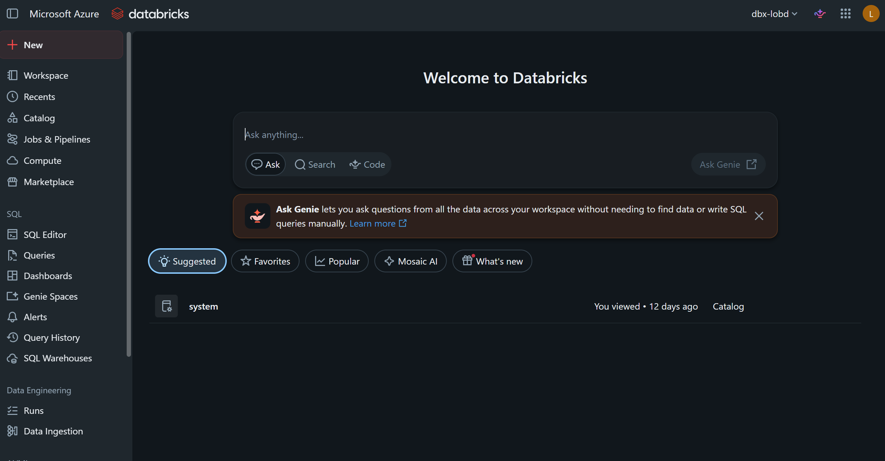
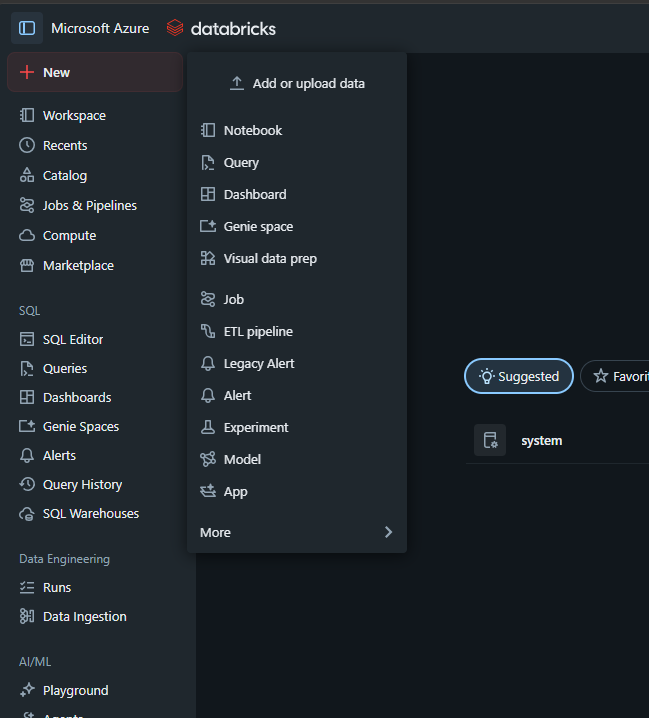
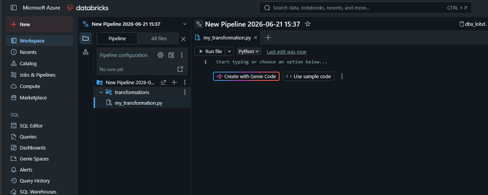
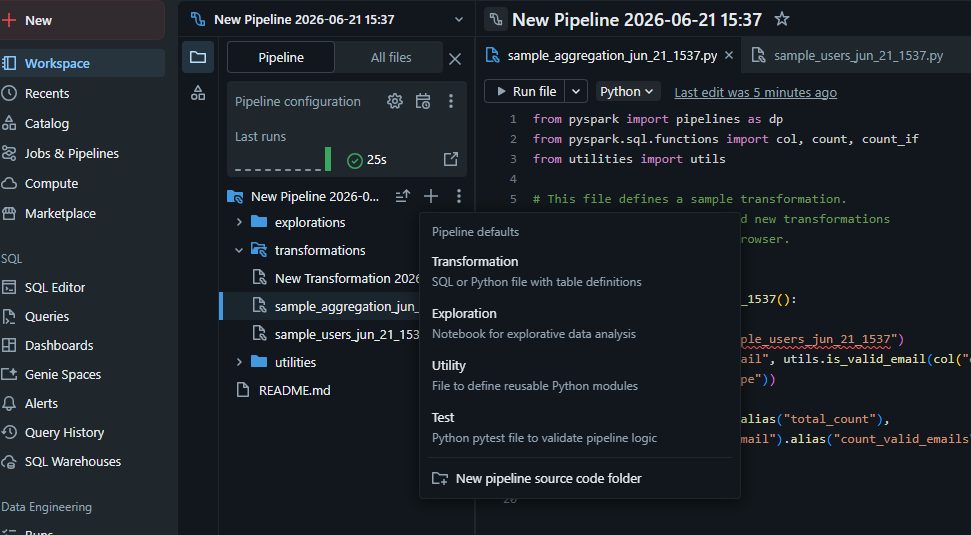
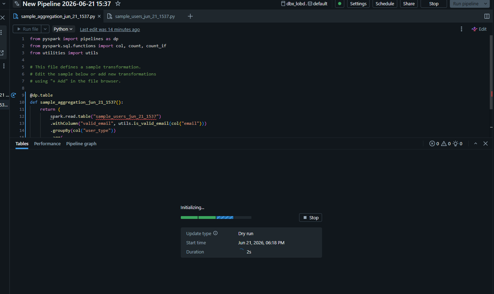

# Screenshots — Activity: create your first Spark Declarative Pipeline (web interface)

> - Target interface: **Databricks – Lakeflow Pipelines Editor** (Spark Declarative Pipelines / SDP).
> - Activity goal: create, run, and explore a first declarative ETL pipeline from the UI.

---

## 0. Prerequisites (optional screenshot)

Open the Databricks workspace with the user already signed in. Capture the full workspace as it appears right after login, then annotate the top-right corner where the user name is displayed to confirm that the session is authenticated.

---

## 1. Start creating the pipeline

In the left sidebar, click the New button to expand it (you can also reach this from the Jobs & Pipelines page), then select ETL Pipeline from the menu. The pipeline editor will open with a default name such as New Pipeline <date> <time> — click the name field to rename it to something meaningful before you continue.

---

## 2. Configure the pipeline

Give your pipeline a meaningful name by typing it into the name field — for example, my-first-pipeline. Next, choose the catalog and schema that will serve as your Unity Catalog destination; this is where the pipeline's output will be written. A starter file named my_transformation is created for you, so use the Python / SQL drop-down to pick the language you want to work in. Finally, before the full editor opens, click Use sample code to start from a working example rather than a blank file.

---

## 3. The Lakeflow Pipelines Editor

Once the editor opens, take a moment to get familiar with the layout: the pipeline asset browser sits on the left, the multi-file code editor occupies the center, and the toolbar runs along the top — these are the three main zones of the IDE you'll be working in. To add your logic, go to the pipeline asset browser, click Add, then choose Transformation. With the new file open, paste in your transformation code — note the declarative style, with decorators like @dp.materialized_view and @dp.table defining your datasets, ingestion logic, and so on.

Do not hesite to compile through the Dry Run to check if you have any pipeline error. 

---

## 4. Run and observe the pipeline

When your code is ready, click the Run (or Run pipeline) button in the pipeline toolbar to start execution. While it's running, you'll see the run in progress — watch the logs and step status to follow what's happening. As the pipeline executes, Databricks builds a data flow graph (a DAG) that links your tables and materialized views, where each node represents a dataset and the connections show how they depend on one another. Once everything finishes, the status will change to Completed with green checkmarks, confirming that the pipeline ran successfully.

---

## 5. Inspect the produced data

With the pipeline complete, you can inspect the output by opening the data preview for any streaming table or materialized view — click the preview tab to see a sample of the result rows. As an optional next step, go to Add → Exploration to create a SQL exploration notebook in the explorations folder, where you can write a query and view its results directly to dig deeper into your data.

---

## 6. (Bonus) Automate the pipeline & Activate logs

To run your pipeline automatically on a regular basis, head to the Jobs & Pipelines page and open the Schedules & Triggers panel, then click Add trigger. From there, configure the schedule settings — the period, time, and time zone — to control when and how often your pipeline runs.

Find where to activate logs in Pipeline configuration and fill the desired schema / table name.

---

## Your turn

Now that you've been praticing SDP, let create a transformation script to import data at the Volumen indicated. The purpose is to create a streaming table thatt ingest data from 

