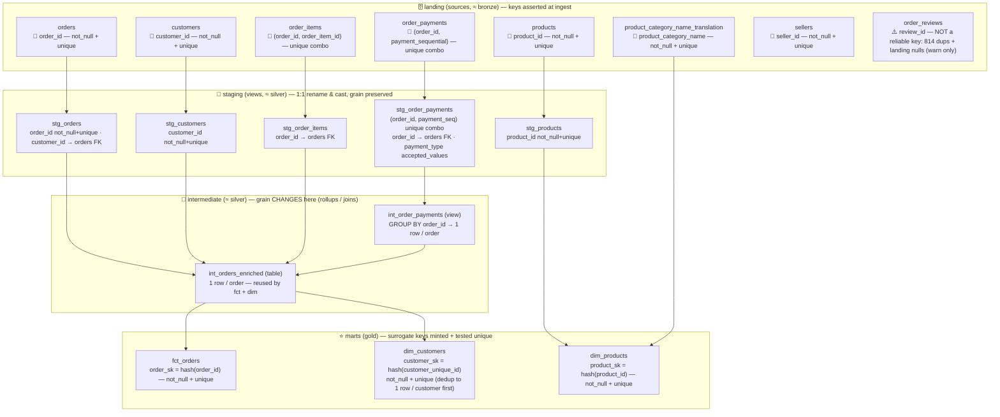

# Data modelling in `dbt_olist` — the why behind the how

This document explains **why** the Olist dbt project is modelled the way it is: which
materialization each layer uses and why, how staging / intermediate / marts are built and
named, the dimensional (Kimball) shape of the marts, how all of that maps onto the medallion
architecture, and the specific design calls we made (and a few we deliberately *didn't* make).
It doubles as the reasoning record behind the lineage diagram at the end.

If you only read one thing: **three modelling frameworks are in play and they are
complementary, not competing.** Medallion tells you *how mature* the data is, dbt layers tell
you *what job* each model does, and Kimball tells you *what shape* the consumable tables take.

---

## 1. Three frameworks, one pipeline

| Framework | Question it answers | Unit | In this project |
|---|---|---|---|
| **Medallion** (Databricks) | *Where does the data sit* on the raw→refined journey? | quality **zones**: bronze / silver / gold | `landing` ≈ bronze; `staging`+`intermediate` ≈ silver; `marts` ≈ gold |
| **dbt layers** | *What transformation job* does this model do? | project **layers**: staging / intermediate / marts | the folder structure under `models/` |
| **Kimball dimensional** | *What shape* do the consumable tables take? | facts, dimensions, **star schema** | `fct_orders`, `dim_customers`, `dim_products` |

**Medallion** is a *data-quality / refinement* idea: bronze = raw as-ingested (replay source of
truth), silver = cleansed, typed, deduped, conformed, gold = business-level aggregates and
dimensional models ready for BI/ML. Its value is progressive refinement, quality gates between
zones, and replayability (keep raw, rebuild everything downstream anytime).

**dbt's layers** are about *transformation responsibility*: staging cleans one source at a
time, intermediate reshapes/joins, marts present business entities. (dbt Labs' "How we
structure our dbt projects".)

**Kimball** is about the *shape users query*: facts (measures + foreign keys at a declared
grain) surrounded by dimensions (descriptive context) in a star schema, with surrogate keys
and slowly-changing-dimension history.

The mapping is the key insight: **dbt staging + intermediate do the silver work; dbt marts are
the gold zone; and the Kimball star lives *inside* gold.** We use dbt's layer **names** (not
literal bronze/silver folders), but the `gld_` prefix on the gold aggregates is the nod to the
medallion gold tier.

---

## 2. The layers in this project, and how they're named

```
models/
  staging/        stg_orders, stg_order_items, stg_order_payments, stg_customers, stg_products   (views)
  intermediate/   int_order_payments (view), int_orders_enriched (table)
  marts/          fct_orders (incremental), dim_customers, dim_products,
                  gld_revenue_by_category, gld_delivery_performance                              (tables)
```

**Staging (`stg_`)** — exactly **one model per source table**, doing *rename + cast only*: no
joins, no aggregation, no business logic. Materialized as **views** (see §3). This is the
"clean the raw" step; it keeps the source grain 1:1, so a `stg_` model is a faithful, typed
mirror of its landing table. Grouped/named by source entity.

**Intermediate (`int_`)** — where we *reshape*: joins, re-graining, rollups. Added **only when
it earns its place** (real complexity, or reuse by more than one downstream model). A mart is
allowed to read staging directly, so we do **not** create intermediate models for their own
sake (see §5, `dim_products`).

**Marts (`fct_`/`dim_`/`gld_`)** — the business-facing layer users query. `fct_`/`dim_` are the
Kimball star; `gld_` are gold business aggregates built on top of the star. Materialized as
**Delta tables**. Named by business concept, not by source.

**Multiple source systems.** dbt merges *all* YAML under `models/`, so sources don't have to live
in one file. With more than one source system you split them **one file per source system** —
`_<source>__sources.yml` (paired with `_<source>__models.yml` and `stg_<source>__<entity>.sql`),
keeping a single source's tables together. Our single `olist_landing` source needs only one
`_sources.yml`, so we keep the simple form.

---

## 3. Materialization decisions, layer by layer (and *why*)

dbt's materializations are: **view**, **table**, **incremental**, **ephemeral**, plus
Databricks' **materialized_view** / **streaming_table**. The project picks the simplest one
that fits each layer.

**Staging → `view`.** Views cost no storage and are recomputed on read. Staging is thin
(rename/cast), runs rarely on its own, and we want it to always reflect the latest source —
so a view is ideal. (It also means the heavy lifting only materializes once, downstream.)

**`int_order_payments` → `view`.** It rolls payment lines up to one row per order. We keep it a
**view, not ephemeral**, on purpose: a view is a real object you can **query and test**
independently; `ephemeral` would inline it as a CTE inside its consumers, so you couldn't
`select * from int_order_payments` to debug it, and you couldn't attach tests to it. The rollup
is cheap, so a view is the right trade.

**`int_orders_enriched` → `table`** (overrides the intermediate "view" default). This is the
big multi-join (orders + customers + items + payments + delivery metrics). It is consumed by
**both `fct_orders` and `dim_customers`**, so materializing it once as a table means the
expensive join runs **once per build** instead of once per consumer. "Reused by ≥2 downstream
models" is the canonical reason to promote an intermediate model from view to table.

**`fct_orders` → `incremental` (merge, Delta).** On the first run it builds a full table; on
later runs it processes only orders newer than the latest already loaded and `MERGE`s them into
the existing Delta table (`incremental_strategy='merge'`, `file_format='delta'`,
`unique_key='order_id'`). This is the realistic pattern for an ever-growing fact.
*Note on the near-duplication with `int_orders_enriched`:* `fct_orders` is essentially
`select generate_surrogate_key, * from int_orders_enriched` plus the incremental filter. The
split is deliberate and pedagogical — `int_orders_enriched` is the **full, always-rebuildable,
testable transform**, while `fct_orders` is the **incrementally-maintained, key-bearing fact**.
In a lean production project you might collapse them (make the enriched model itself
incremental); we keep them separate to demonstrate `incremental` cleanly on top of a stable
transform. The cost is storing nearly the same data twice — a reasonable teaching trade.

**`dim_customers`, `dim_products`, `gld_*` → `table`.** Dimensions and gold aggregates are
read frequently by BI, so we pay the storage to get fast reads. They rebuild fully each run
(small enough that incremental isn't worth the complexity).

**Why not `materialized_view` / `streaming_table` here?** Both are real options on Databricks
(Lakeflow-backed) and map to genuine Olist needs, but our data is a fixed 2016–18 batch with a
Power BI demo on top — a plain `table` is simpler and fully dbt-controlled. We reach for the
Databricks-managed materializations only when auto-refresh / streaming actually pays for its
extra wiring. (`streaming_table` is dbt-databricks-only; `materialized_view` also exists on
Postgres / Snowflake / BigQuery.)

**Ephemeral vs a macro (a common point of confusion):** an **ephemeral model** is a *node in
the DAG* — it has lineage, can be `ref()`'d, and compiles to a CTE inlined into its consumers
(no object created). A **macro** is *templated SQL/Jinja* with no lineage — it's a function you
call to generate SQL (e.g. `generate_surrogate_key`, `generate_schema_name`). Use ephemeral for
a lightweight reusable *transformation step*; use a macro for reusable *SQL fragments / logic*.

---

## 4. The dimensional (Kimball) layer

`fct_orders` (the fact) sits at **order grain** — one row per order — carrying measures
(`order_total`, `days_to_deliver`, `is_late`, payment metrics) and a surrogate key.
`dim_customers` and `dim_products` are the conformed dimensions. That's a small star schema;
`gld_revenue_by_category` and `gld_delivery_performance` are pre-aggregated gold tables built on
the star for BI speed.

### Natural vs composite vs surrogate keys

- **Natural key** — a real identifier in the data: `order_id`, `customer_unique_id`,
  `product_id`.
- **Composite key** — when no single column is unique, the key is several columns together:
  `order_items` is unique only on `(order_id, order_item_id)`; `order_payments` only on
  `(order_id, payment_sequential)`.
- **Surrogate key** — a single synthetic column that stands in for the (possibly composite)
  natural key, used as the PK and the join target. We mint them with
  `dbt_utils.generate_surrogate_key([...])`, which **hashes** (MD5) the listed columns into one
  deterministic, null-safe value. The benefit: facts join on one clean column even when the
  natural key is composite, and the key type is uniform across all dimensions.

### How we *guarantee* a surrogate key is unique

The hash **does not create uniqueness — it preserves the uniqueness of its inputs.** So a
surrogate key is trustworthy only when three things hold, and we enforce all three:

1. **Hash the true grain columns** (e.g. `order_id` for `fct_orders`; `customer_unique_id` for
   `dim_customers`).
2. **Emit exactly one row per that grain before hashing.** This is why `dim_customers` first
   **dedups** to one row per `customer_unique_id` (a customer can appear under several per-order
   `customer_id` rows with different cities — 122 such customers — so we pick the *latest-order*
   location via `row_number()`), *then* hashes.
3. **Test it.** A `not_null + unique` test on the `_sk` column proves the grain assumption — it
   is the test that originally caught the 122-row `dim_customers` duplication. All three marts
   test their surrogate key directly (defense-in-depth: it also catches future changes that
   alter the hash inputs or fan out rows).

---

## 5. Specific design decisions (the Q&A record)

**Why `order_payments` is rolled up in *intermediate*, not staging — yet we still added
`stg_order_payments`.** Rolling payments up to order grain is a **grain change** (`GROUP BY
order_id`), which is business logic and belongs in intermediate, not staging. *But* we still
add a `stg_order_payments` (rename + cast, payment-line grain) for three reasons: **consistency**
(every other source has a `stg_` model — the lone exception invites "why is this different?"),
**single responsibility** (staging owns the cast; the intermediate model then owns *only* the
rollup), and **reusability** (any payment-*line*-grain consumer — e.g. a future payment-behaviour
mart that needs `payment_type` per line — should build on `stg_order_payments`, not re-read the
source). Skipping it is a defensible shortcut; adding it is the more correct, consistent pattern.

**`customer_id` vs `customer_unique_id`.** In Olist, `customer_id` is **per-order** (a new id
per order) — it's the technical **join key** between `orders` and `customers`.
`customer_unique_id` is the **stable business identity** of the actual person and is the analytics
grain for `dim_customers`. We keep `customer_id` for joining and use `customer_unique_id` as the
dimension grain.

**`n_payment_rows` / `max_installments`.** `n_payment_rows` = how many payment lines an order
has (`>1` ⇒ split/multi-tender, e.g. voucher + card). `max_installments` = the largest
credit-card instalment count (Brazilian financing behaviour). They're computed in
`int_order_payments`; `max_installments` flows downstream while `n_payment_rows` is currently
latent (available for a future payment-behaviour mart).

**`dim_customers` location = latest order, not most-frequent.** A judgement call: latest =
"where the customer is now" (SCD-1 latest-wins, good for current contactability); most-frequent
would better represent a "home base". Both are valid; the important part is that the choice is
**deterministic** (tie-broken by state/city) and **documented**.

**`dim_products` reads `stg_products` directly — no intermediate.** The dimension is just
"staging + a category-translation join + a label" — light enough to build straight on staging.
dbt's own guidance is *don't invent intermediate models for their own sake*. We'd only add an
`int_products_*` if multiple marts needed the same product enrichment.

**The seed `br_state_regions.csv`.** It maps Brazil's 27 states to the 5 official IBGE
macro-regions (Norte / Nordeste / Centro-Oeste / Sudeste / Sul). It is **not** part of Olist —
it's small, static, real reference data authored for the project, which is exactly the canonical
use case for a dbt **seed**.

**The `orders_snapshot`.** A standalone **demonstration** of dbt snapshots (SCD-2, `check`
strategy on `order_status`). Nothing downstream consumes it yet; to "use" it a mart would join
the history (e.g. time-in-status). It snapshots the **raw source directly**, which is the
dbt-recommended pattern (capture truth before transforms). Note: snapshotting a static source is
artificial — it'll only ever capture one version unless the source changes — so it's purely
pedagogical here.

**`review_id` is a deliberately *dirty* key.** It is **not unique** (814 duplicates) *and* the
landing table can carry a **null** (the raw CSV is clean, but ingesting multi-line review text
left a null in Delta). So instead of enforcing `not_null`, we flag it with `config: severity:
warn` — you don't gate the pipeline on a column you never use as a key. It's a useful real-world
counter-example to "all landing keys are unique + non-null".

---

## 6. How our example maps onto the medallion picture

| Medallion zone | dbt layer | Olist models | Kimball role |
|---|---|---|---|
| **bronze** (raw) | `source('olist_landing', …)` | the 8 landing tables (dbt never ingests these) | — |
| **silver** (clean/conformed) | staging | `stg_orders`, `stg_order_items`, `stg_order_payments`, `stg_customers`, `stg_products` | — |
| **silver** | intermediate | `int_order_payments` (view), `int_orders_enriched` (table) | — |
| **gold** (business-ready) | marts | `dim_customers`, `dim_products`, `fct_orders` | the **star** (surrogate keys) |
| **gold** | marts | `gld_revenue_by_category`, `gld_delivery_performance` | gold **aggregates** on the star |

**What we gained:** clear per-model responsibility (clean vs reshape vs serve), a **testable
grain** at every layer, surrogate keys that are *provably* unique (§4), and compute reuse
(`int_orders_enriched` materialized once, consumed by both the fact and a dimension).

---

## 7. Key integrity across the lineage

How the project **guarantees** that the keys we ingest at *landing* are unique and non-null, and
how that guarantee carries downstream so the **surrogate keys** in the marts are provably sound.
Every claim below is enforced by a dbt test (so `dbt build` fails if it stops being true) and was
validated against the real Olist data.

> The hash in `generate_surrogate_key` does **not create** uniqueness — it *preserves* the
> uniqueness of its inputs. So a surrogate key is only trustworthy if (a) we hash the true grain
> columns, (b) the model emits exactly one row per that grain, and (c) a `unique` test proves it.

### Annotated lineage



### The integrity chain, layer by layer

**1. Landing — assert the source keys before we trust them.** Each landing table declares its
primary key with `not_null` + `unique` (or `dbt_utils.unique_combination_of_columns` for the two
composite grains). If an upstream load duplicates an `order_id` or nulls a `customer_id`, the
build fails *at the source layer*, before bad keys propagate. The one deliberate exception is
`order_reviews.review_id` (warn severity — see §5). Validated counts:

| Source | Key | Rows | Result |
|---|---|---:|---|
| orders | order_id | 99,441 | unique + not_null ✓ |
| customers | customer_id | 99,441 | unique + not_null ✓ |
| products | product_id | 32,951 | unique + not_null ✓ |
| product_category_name_translation | product_category_name | 71 | unique + not_null ✓ |
| sellers | seller_id | 3,095 | unique + not_null ✓ |
| order_items | (order_id, order_item_id) | 112,650 | unique combo ✓ |
| order_payments | (order_id, payment_sequential) | 103,886 | unique combo ✓ |
| order_reviews | review_id | 99,224 | **warn-only** — 814 dups *and* nullable in landing |

**2. Staging — preserve grain, re-assert keys, add referential integrity.** Staging is 1:1 with
the source, so the same key tests still hold; we *also* add `relationships` (FK) tests (every
`stg_order_payments.order_id` / `stg_order_items.order_id` exists in `stg_orders` — validated 0
orphans) and an `accepted_values` test on `stg_order_payments.payment_type`.

**3. Intermediate — grain deliberately changes.** `int_order_payments` `GROUP BY order_id`
collapses payment-line grain to one row per order; `int_orders_enriched` joins to one row per
order and is a **table** because two marts reuse it.

**4. Marts — mint surrogate keys, and prove they're unique.** `order_sk`, `customer_sk`,
`product_sk` each via `generate_surrogate_key`, each tested `not_null + unique` (with
`dim_customers` deduping to one row per customer *before* hashing).

### See it live
`dbt docs generate && dbt docs serve` renders this DAG interactively (model- and column-level);
`dbt build` is the executable proof — it runs every test above in dependency order and stops the
moment a key assumption breaks.

---

## 8. Testing strategy by layer

Tests are placed where the thing they assert is *true*, which mostly tracks the layer:

- **Staging** carries the **structural + source-domain** tests: `not_null` / `unique` on keys,
  `relationships` (FK) between staged tables, and `accepted_values` for closed source domains
  (`payment_type`, `order_status`, and a review `review_score ∈ 1–5`). These describe the raw
  source as ingested, so they belong next to the staging models.
- **Intermediate / marts** carry the **distribution and business-value** expectations — the
  `dbt_expectations` checks (e.g. `expect_column_values_to_be_between` on percentages `0–100`,
  non-negative revenue). Those values don't exist until a model *produces* them, so the test lives
  where the value is created.

A nuance worth stating explicitly for trainees: **`dbt_expectations` is allowed in staging** when
it expresses a genuine *source-domain* constraint (a numeric range that's true of the raw column,
say). The "expectations live downstream" split is a **convention that keeps tests near the value
they describe — not a hard rule.** Put the test where the assertion is meaningful.
